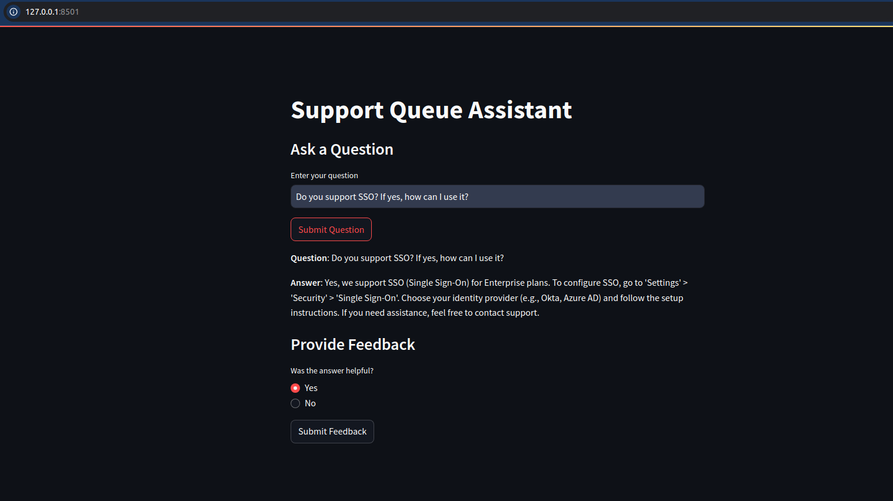

# Support Queue Assistant

This is your friendly customer-support-queue assistant which is a RAG application built with LLM.


<!--  -->

## Problem Description

**Support Queue Assistant** aims to address a common issue faced by B2B SaaS companies—managing high volumes of customer support inquiries efficiently and accurately. Customers frequently have questions related to account management, billing, technical issues, and general inquiries, and manually handling these queries can be resource-intensive for support teams.

#### Key Challenges:

- **Scalability**: As the number of customers grows, the volume of support queries increases, which can overwhelm support teams.
- **Response Time**: Customers expect quick and accurate responses, but delays can occur if support teams are overloaded.
- **Consistency**: Ensuring that responses are consistent and accurate across different customer interactions can be challenging.

To solve these problems, **Support Queue Assistant** leverages a Retrieval-Augmented Generation (RAG) application that provides relevant, real-time responses to customer inquiries by retrieving data from a pre-defined knowledge base and generating accurate, context-specific responses.

## Project overview

#### What Does the Support Queue Assistant Do?

The **Support Queue Assistant** helps users by providing immediate and accurate answers to common support questions. Key functionalities include:

- **Real-Time Assistance**: Users can chat with the assistant to ask questions like "How do I reset my password?" or "What payment methods do you accept?".
- **Knowledge Base Retrieval**: The system pulls relevant information from the knowledge base to generate helpful responses.
- **Consistency and Accuracy**: Responses are based on predefined categories and intents, ensuring users receive consistent answers across similar inquiries.
- **Improved Response Time**: By automating common support queries, the assistant reduces the response time and workload on the human support team.

## Dataset

The dataset for this project is designed to address frequent customer support queries and contains 125 records. Each record includes information about the customer query, its category, intent, and a recommended response, along with related articles and tags for better searchability.

Here’s the structure of the dataset:

| Column              | Description                                                                            |
|---------------------|----------------------------------------------------------------------------------------|
| `id`                | Unique identifier for each query.                                                      |
| `question`          | The question posed by the customer.                                                    |
| `category`          | Broad category of the query (e.g., Account, Billing, Technical, General Inquiry).       |
| `subcategory`       | Specific subcategory within the broader category (e.g., Password Management, Integrations). |
| `intent`            | The intent of the query (e.g., Password Recovery, Payment Information, API & Integrations). |
| `product_feature`   | The product feature related to the query (e.g., Authentication & Security, Billing & Invoicing). |
| `response`          | The automated response provided to the user based on the query.                         |
| `related_articles`  | Links to related help articles that provide more detailed information.                  |
| `tags`              | Keywords to aid in search and retrieval of similar queries.                             |


You can find data in [`data/data-clean.csv`](data/data-clean.csv).

## Technologies

- Python 3.12
- Minsearch for in memory full-text search
- Docker and Docker Compose for containerization
- Flask as the API interface - to be used by any other UX
- Streamlit as direct user interface
- Grafana for monitoring and PostgreSQL as the backend for it
- OpenAI as an LLM

## prerequisites

1. Since we use OpenAI, you need to provide the API key.
    - For OpenAI, it's recommended to create a new project and use a separate key.
    - Go to `https://platform.openai.com/`
    - Create project: `support-queue-assistant-rag`
    - Within that project, create `project API Key`

2. GitHub:
    - Create repo:`support-queue-assistant-rag`
    - Start codespace and connect to it from your IDE e. g. VS Code

3. Codespace:

    - Install `direnv`. If you use Ubuntu, run `sudo apt install direnv` and then `direnv hook bash >> ~/.bashrc`.

        Alternatively, follow instructions from `https://direnv.net/docs/installation.html`
    - Copy `.envrc_template` into `.envrc` and insert your key there.
    - Run `direnv allow` to load the key into your environment.

For dependency management, we use pipenv, so you need to install it:
```
pip install pipenv
```

Once installed, you can install the app dependencies:
```
    pipenv install openai scikit-learn pandas flask
    pipenv install --dev tqdm notebook==7.1.2 ipywidgets
```


## Experiments

For experiments, we use Jupyter notebooks. They are in the [`notebooks`](notebooks) folder.

To start Jupyter, run:

```
cd notebooks
pipenv run jupyter notebook
```

Alternatively you can use Jupyter notebooks via `jupyter-lab`:

```
pipenv run jupyter-lab
```

We have the following notebooks:

- [`data-cleaning.ipynb`](notebooks/data-cleaning.ipynb): Checking data and cleaning if needed.
- [`evaluation-data-generation.ipynb`](notebooks/evaluation-data-generation.ipynb): Generating the ground truth dataset for retrieval evaluation.
- [`rag-test.ipynb`](notebooks/rag-test.ipynb): The RAG flow and evaluating the system.


### Retrieval evaluation

The basic approach - using 'minsearch' without any boosting - gave the following metrics:

- Hit rate: 96%
- MRR: 83%

The improved version (with tuned boosting):

- Hit rate: 97%
- MRR: 87%

The best boosting parameters:
```
boost = {
    'question': 2.32,
    'category': 0.34,
    'subcategory': 1.20,
    'intent': 1.52,
    'product_feature': 1.16,
    'response': 2.51,
    'related_articles': 0.24,
    'tags': 1.66,
}
```

### RAG flow evaluation

We used the `LLM-as-a-Judge metric` to evaluate the quality of our RAG flow.

For `gpt-4o-mini`, in a sample with 200 records, we had:

- 188 (94%) `RELEVANT`
- 11 (5.5%) `PARTLY_RELEVANT`
- 1 (.05%) `NON_RELEVANT`

We also tested `gpt-4o`:

- 189 (94.5%) `RELEVANT`
- 11 (5.5%) `PARTLY_RELEVANT`
- 0 (0%) `NON_RELEVANT`

The difference is minimal, so we opted for `gpt-4o-mini`.


## Running the API

1. Run Flask app
```
cd support-queue-assistant-flask
pipenv run python app.py
```

### Testing the API using `requests`

When the API is running, you can use requests to send questions — use `test.py` for testing it:

```
pipenv run python test.py
```
It will pick a random question from the ground truth dataset and send it to the app.

You will see something like the following in the response:

```
question:  How does your company ensure transparent communication during a security incident?

{'answer': 'Our company ensures transparent communication during a security incident by committing to keep customers informed throughout our incident response process, which includes the following steps: detection and alerting, assessment and triage, containment and mitigation, customer communication, resolution and recovery, and a post-incident review. You can find more details on our incident response in the related articles.',
'conversation_id': 'dd68ba3e-230b-4dd2-b6fa-92e639acebe0',
'question': 'How does your company ensure transparent communication during a security incident?'}
```

## Using the application

When the API is running, we can start using it.

### Using user's question
```
pipenv run python user-query.py
```
User will see a prompt to ask question and something like the following in the response:
```
Please enter your question: Do you support SSO? If yes, how can I use it?

Response:
{'answer': "Yes, we support SSO (Single Sign-On) for Enterprise plans. To use it, go to 'Settings' > 'Security' > 'Single Sign-On'. From there, you can choose your identity provider (e.g., Okta, Azure AD) and follow the setup instructions provided. If you need further assistance, you can contact support.",
'conversation_id': '70d99e6a-4541-47f1-9f3b-63782f5e7e07',
'question': 'Do you support SSO? If yes, how can I use it?'}
```

### Using `streamlit` user interface

Start streamlit.
```
cd support-queue-assistant/
pipenv run streamlit run streamlit-app.py
```
Open this link in your browser to use the app: `http://localhost:8501`



## Code

The code for the application is in the [`support-queue-assistant`](support-queue-assistant) folder:

- [`app.py`](support-queue-assistant/app.py) - the Flask API, the main entrypoint to the application
- [`rag.py`](support-queue-assistant/rag.py) - the main RAG logic for building the retrieving the data and building the prompt
- [`ingest.py`](support-queue-assistant/ingest.py) - loading the data into the knowledge base
- [`minsearch.py`](support-queue-assistant/minsearch.py) - an in-memory search engine
- [`db.py`](support-queue-assistant/db.py) - the logic for logging the requests and responses to postgres
- [`db_prep.py`](support-queue-assistant/db_prep.py) - the script for initializing the database
-[`streamlit-app.py`](support-queue-assistant/streamlit-app.py)


We also have some code in the project root directory:

- [`test.py`](test.py) - select a random question for testing
- [`user-query.py`](user-query.py) - User will see a prompt to ask question

### Interface

We use Flask for serving the application as an API.

### Data Ingestion

The ingestion script is in [`ingest.py`](support-queue-assistant/ingest.py).

Since we use an in-memory database, `minsearch`, as our knowledge base, we run the ingestion script at the startup of the application.

It's executed inside [`rag.py`](support-queue-assistant/rag.py) when we import it.


## Monitoring


### Dashboards


## Conclusion

The **Support Queue Assistant** streamlines the customer support process for B2B SaaS companies by automating responses to frequent inquiries, improving response time, and ensuring consistency. The RAG-based approach ensures users get the most relevant and accurate information based on their needs, while freeing up valuable resources for more complex tasks.


## Acknowledgements


## Next steps